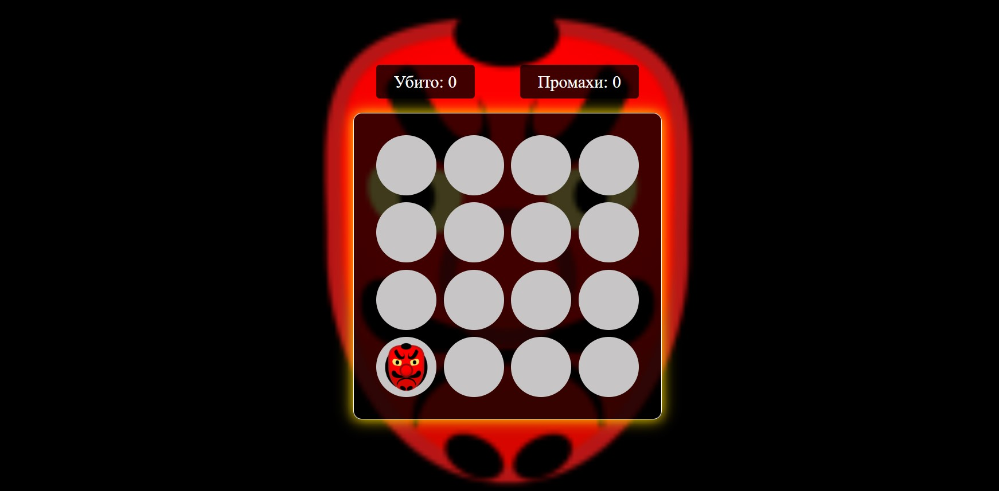

[GitHub Pages Game](https://lekseff.github.io/AHJ_3-1/)

### Игра с гоблинами

#### Описание:

1. Гоблин появляется в рандомной точке.
2. Если пользователь успел за это время кликнуть на этой точке, то:
    * пользователю засчитывается +1 балл
    * гоблин пропадает из ячейки
3. Если пользователь пропустил 10 появлений гоблинов, то игра завершается.
4. Скорость игры возрастает с увеличением количества попаданий